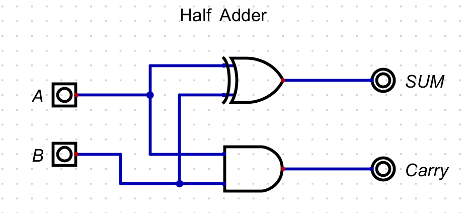

# CPU de 8 bits 

Este projeto apresenta a implementação de uma CPU de 8 bits funcional. O objetivo é demonstrar a construção dos componentes fundamentais, desde os blocos lógicos mais simples até a integração de uma Unidade Lógica e Aritmética (ULA) e uma Unidade de Controle capaz de executar um conjunto de instruções.

## Vídeos da Demonstração

- [Vídeo 1 — Blocos Fundamentais](https://drive.google.com/drive/u/0/folders/1U9V4IiraTXAVxcejg288d7yYNc-V21Le?hl=pt-BR)
- [Vídeo 2 — ULA Completa](https://drive.google.com/drive/u/0/folders/1U9V4IiraTXAVxcejg288d7yYNc-V21Le?hl=pt-BR)
- [Vídeo 3 — Memória, PC e Caminho de Dados](https://drive.google.com/drive/u/0/folders/1U9V4IiraTXAVxcejg288d7yYNc-V21Le?hl=pt-BR)
- [Vídeo 4 — Unidade de Controle e CPU Completa](https://drive.google.com/drive/u/0/folders/1U9V4IiraTXAVxcejg288d7yYNc-V21Le?hl=pt-BR)

## 1. Blocos Fundamentais da Aritmética

A base para qualquer operação aritmética em uma CPU começa com a capacidade de somar dois bits. A partir de componentes simples, construímos progressivamente circuitos mais complexos capazes de realizar cálculos com palavras de 8 bits.

### Half Adder (Meio Somador)

O **Half Adder** é o circuito mais elementar para a soma binária. Ele recebe dois bits como entrada (A e B) e produz duas saídas: a **Soma (Sum)** e o **Transporte (Carry)**. A soma é o resultado da operação XOR entre as entradas, e o transporte é o resultado da operação AND.

### Full Adder (Somador Completo)

Para construir somadores maiores, precisamos de um componente que possa lidar com um bit de transporte vindo de uma soma anterior. O **Full Adder** resolve isso: ele é construído a partir de dois Half Adders e uma porta OR. Ele soma três bits (A, B e um Carry-In) e produz uma saída de Soma (Sum) e um Carry-Out.

### 8-bit Adder (Somador de 8 bits)

Com o Full Adder como bloco de construção, podemos criar um somador para qualquer número de bits simplesmente conectando-os em cascata. O **Somador de 8 bits** é composto por oito Full Adders, onde o Carry-Out de um estágio é conectado ao Carry-In do próximo. Este circuito forma a base para a operação de soma na nossa ULA, sendo capaz de somar dois números de 8 bits.

## 2. A ULA (Unidade Lógica e Aritmética)

A Unidade Lógica e Aritmética (ULA, ou ALU em inglês) é o coração computacional da CPU. Ela é um circuito combinacional complexo que executa as operações de cálculo (soma, subtração, etc.) e lógicas. Nossa ULA foi projetada para realizar todas as operações exigidas e selecionar o resultado apropriado com base em um sinal de controle.

### Subtrator de 8 bits

A operação de subtração (`A - B`) é implementada de forma eficiente utilizando o somador de 8 bits. Isso é possível através da técnica do **complemento de dois**. O operando `B` é invertido (complemento de um) e, em seguida, somamos `1` ao resultado. Isso é feito de forma prática invertendo todos os bits de `B` com portas NOT e definindo o `Carry-In` inicial do somador como `1`.

### Multiplicador e Divisor (Operandos de 4 bits)

Para as operações de multiplicação e divisão, foram criados circuitos específicos que operam com operandos de 4 bits, conforme especificado no enunciado.

* **Multiplicador:** Utiliza uma série de portas AND para gerar os produtos parciais e, em seguida, usa somadores para combinar esses produtos e gerar o resultado final de 8 bits.
* **Divisor:** Implementa a lógica de divisão binária para calcular um **Quociente (Q)** e um **Resto (R)** a partir de dois operandos de 4 bits.

### Integração da ULA

O circuito final da ULA reúne todas as unidades operacionais: somador, subtrator, multiplicador, divisor, incrementador, decrementador e shifter. Um **Multiplexador (MUX)** de 8 canais é o componente chave aqui. Ele recebe o resultado de cada uma dessas operações.

A entrada de controle **`OP[3:0]`** (Opcode) determina qual resultado o MUX selecionará para ser a saída final da ULA (`Result`).

Além disso, a ULA gera a **`FlagZero`**. Esta saída se torna `1` somente quando o resultado da operação é exatamente zero. Isso é feito com uma porta NOR de 8 entradas, que é fundamental para a implementação de saltos condicionais na Unidade de Controle.

## 3. A Arquitetura e o Caminho de Dados

Enquanto a ULA é o centro de cálculo, a arquitetura define como os dados se movem e são armazenados. O Caminho de Dados (Datapath) é o conjunto de registradores, barramentos (bus) e outros componentes que formam o "sistema circulatório" da CPU, permitindo que os dados fluam entre a memória, a ULA e os registradores.

### Memória

O bloco de memória armazena tanto as instruções do programa quanto os dados. Para acessar uma posição, seu endereço é primeiro carregado no **MAR (Memory Address Register)**. A memória então disponibiliza o dado contido nesse endereço na sua saída (`Data_Out`). Para este projeto, foi utilizada uma ROM para que o programa não se perca entre as simulações.

### Program Counter (PC)

O **Program Counter (PC)** é um registrador especial que tem uma função crucial: apontar para o endereço da próxima instrução a ser executada na memória. A cada ciclo de busca (fetch), o PC é incrementado. Em operações de desvio (Jumps), um novo endereço pode ser carregado diretamente no PC, alterando o fluxo de execução do programa. Ele possui sinais de controle para habilitar a contagem (`PCE`), carregar um novo valor (`PCL`) e resetar.

### Caminho de Dados (Datapath)

O diagrama do Caminho de Dados (`Caminhos.dig`) mostra a interconexão de todos os componentes principais. Nele, podemos observar:

* **Registradores A e B:** São registradores de uso geral que armazenam os operandos para a ULA. Um deles atua como o **Acumulador** principal, onde os resultados das operações são geralmente guardados.
* **Registrador de Instrução (IR):** Armazena a instrução de 8 bits que foi buscada da memória. A saída deste registrador é dividida:
    * Os 4 bits de mais alta ordem (`Q_out[7:4]`) servem como um operando ou endereço.
    * Os 4 bits de mais baixa ordem (`Q_out[3:0]`) representam o **Opcode**, que é enviado para a Unidade de Controle.
* **Barramento Principal (WBus):** No centro do datapath, um grande multiplexador atua como o barramento principal. Ele seleciona qual dado será escrito nos registradores, podendo vir do resultado da ULA, de um operando no IR, da memória ou do PC.

Esse arranjo permite um fluxo de dados ordenado, onde a Unidade de Controle gerencia os sinais (`RGA_Ld`, `RGB_Ld`, `WBus_Sel`, etc.) para garantir que a informação correta chegue ao lugar certo no momento certo.

## 4. A Unidade de Controle e os Ciclos da CPU

A Unidade de Controle (UC) é o componente que comanda o datapath, orquestrando o fluxo de dados e a execução de instruções. Ela não processa dados, mas gera os sinais de controle que dizem a todos os outros componentes o que fazer e quando. A UC opera em um ciclo contínuo de busca (fetch) e execução (execute).

### O Sequenciador

A base para o funcionamento da UC é o tempo. O **Sequenciador** é um circuito que gera uma sequência de pulsos de tempo (estados `T1` a `T6`). A cada pulso de clock, ele avança para o próximo estado, reiniciando ao final. Cada estado `T` corresponde a um passo em um ciclo da CPU, permitindo que operações complexas sejam divididas em etapas menores e sincronizadas.

### Lógica de Controle e Conjunto de Instruções

A lógica principal do **Controlador** combina três informações:
1.  O **Opcode** da instrução atual (vindo do Registrador de Instrução).
2.  O **estado de tempo** atual (vindo do Sequenciador, ex: `T1`, `T2`...).
3.  **Flags de estado** (como a `FlagZero` da ULA).

Com base nessa combinação, um grande circuito de lógica combinacional (portas AND/OR) ativa os sinais de controle corretos para o datapath. O conjunto de instruções implementado pode ser visto no decodificador de opcodes dentro do controlador:

| Mnemonico | Descrição                        |
|-----------|------------------------------------|
| **NOP** | Nenhuma Operação                   |
| **LDA** | Carrega um valor no Acumulador     |
| **ADD** | Soma o valor ao Acumulador         |
| **SUB** | Subtrai o valor do Acumulador      |
| **MULT** | Multiplica o Acumulador            |
| **DIV** | Divide o Acumulador                |
| **INC** | Incrementa o Acumulador            |
| **DEC** | Decrementa o Acumulador            |
| **JMP** | Salto Incondicional (Jump)         |
| **JMPZ** | Salto se o Acumulador for Zero     |
| **OUT** | Envia o valor do Acumulador para a saída |
| **HLT** | Para a execução (Halt)             |

### Ciclo de Busca (Fetch)

O ciclo de busca é a primeira fase e é idêntico para todas as instruções. Ele ocorre nos primeiros estados de tempo (`T1` a `T3`):
* **T1:** O endereço do PC é colocado no barramento e carregado no MAR.
* **T2:** O dado apontado pelo MAR (a instrução) é carregado no Registrador de Instrução (IR).
* **T3:** O PC é incrementado para apontar para a próxima instrução.

### Ciclo de Execução (Execute)

Após `T3`, a UC entra no ciclo de execução. A sequência de ações aqui depende do opcode decodificado.
* **Para uma instrução `ADD`:** Em `T4` e `T5`, a UC comanda a ULA para realizar a soma e, em seguida, comanda o Acumulador para carregar o resultado do barramento.
* **Para uma instrução `JMP`:** A UC ativa o sinal de carga do PC (`PCLd`), fazendo com que ele receba o endereço contido na parte de dados da instrução.
* **Para uma instrução `JMPZ`:** A lógica é similar à do `JMP`, mas o sinal `PCLd` só é ativado se a `FlagZero` (iZf) estiver em nível alto (1), indicando que o resultado da última operação foi zero.

## 5. Integração Final e Demonstração

Finalmente, todos os componentes modulares são conectados para formar a CPU completa. O diagrama principal (`main_cpu.dig`) mostra a união do Caminho de Dados com a Unidade de Controle, além de componentes globais como o clock, o reset e os displays de saída.

### O Circuito Principal (MAIN)

No nível mais alto, a Unidade de Controle envia seus sinais para governar o PC, a Memória e o Caminho de Dados. O clock principal (`CLK`) sincroniza todas as operações, e um sinal de `HLT` (Halt) é usado para parar o clock da CPU, finalizando a execução do programa. A saída para os displays de 7 segmentos é conectada a um registrador que captura o valor do barramento quando a instrução `OUT` é executada.

### Demonstração de Funcionamento

Para validar a CPU, um programa foi carregado na memória para executar uma série de cálculos. A execução foi capturada em três momentos:

**1. Estado Inicial:** Antes de iniciar o clock, a CPU está em seu estado de reset. Os registradores estão zerados e os displays mostram **"00"**.

**2. Em Execução:** Após iniciar o clock, a CPU começa a executar o programa. Este snapshot captura o momento em que o Program Counter está no endereço **`0x02`**. Note que, embora a CPU esteja processando, o display ainda não foi atualizado e permanece em "00", aguardando uma instrução `OUT`.

**3. Resultado Final:** Após a conclusão dos cálculos e a execução da instrução `OUT`, o resultado final é enviado para o registrador de saída. O display agora mostra o valor hexadecimal **"Fd"** (equivalente a 253 em decimal).

Esta sequência demonstra com sucesso que a CPU está funcional, executando as instruções corretamente, processando os dados e atualizando a saída como esperado.

## Estrutura de Arquivos do Projeto

O projeto foi organizado de forma modular, com cada componente principal em seu próprio arquivo `.dig`.

